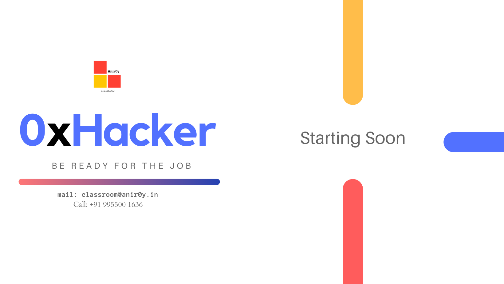

## OverView

This is the fundamental course to get you started with cyber security domain. This course is designed for entry level/ freshers who have little bit idea on cyber security but not the technical part. This Course will help you learn about the basic fundamentals of cybersecurity, CIA, Risk assessment & Management, framework (MITRE) , OS security & Hacking and web technology.

### New Batch Starts on Soon!!! req a callback for more info: 

https://bit.ly/anir0y-callback

### Download the Content from [here](https://github.com/anir0y/anir0y.github.io/raw/master/pdf/0xhacker-L1.pdf)

